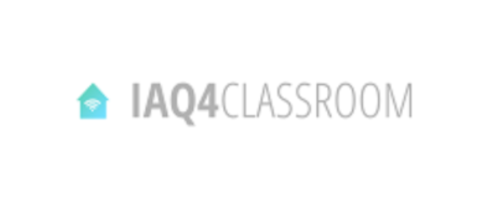

<!-- # IAQ4CLASSROOM -->

<!--  -->

<!-- > IAQ4CLASSROOM  Project -->

## ✔️ Improvements

The project is still under development and future updates will focus on the following tasks:
<!-- - [x] Tarefa 1 -->
<!--- [ ] Task 1 
- [ ] Task 2
- [ ] Task 3
- [ ] Task 4 -->
- [ ] Update Firmware
    - [ ] Implement Errors Function;
    - [ ] Implement User Output (LED Function);
    - [ ] Organize and clean de code;
- [ ] Dashboard
    - [ ] Implement/Add the other schools;
    - [ ] Improve User Interface;
    - [ ] Implement Notifications/Alerts;
    - [ ] Implement Guest Mode;
 

## ℹ️ Devices Info

Device: DIAQ03

* Device Address: 04 bf 80 aa
* NWK Key: 46 13 e5 40 bd 5c e0 91 8b 73 0a c0 97 2c 88 38
* APP Key: 6d f1 a7 ab c9 d6 4d 4b b4 30 69 d1 5a 27 f6 ae

Device: DIAQ04
*	Device Address: 05 32 cd b2
*	NWK Key: 8c 9d 10 c0 2c 28 dd d2 dc 21 7d 4a 69 ad f0 e7
*	APP Key: cf c0 21 2c 4f 5e 5c 2e 17 0f d4 4e 1e 99 f4 c7

Device: DIAQ05
*	Device Address: 04 70 9e 1f
*	NWK Key: 72 38 bf 63 32 9e 48 41 d7 f9 7e 7a 9f 5e 0f d8
*	APP Key: 60 5f 42 d3 9e 4a 10 d3 91 55 14 80 08 56 8c ba

Device: DIAQ06 
*	Device Address: 04 5b f3 25
*	NWK Key: 8b b0 6a 31 9c 98 dc 02 34 37 aa 35 0c 3b a3 b0
* APP Key: 8f 6b 0d 3c 66 79 33 7b 0a 3a d7 9d 1d d0 99 6e

 

## 🌐 Useful Links

 [SMART-IPVC Plataform](http://smart.ipvc.pt/projects/) 
 [IAQ Dashboard](http://smart.ipvc.pt:4062/#/login) 
 [Technical Report](https://www.overleaf.com/read/kwktbmybzfxk) 
 [LoRaServer](https://loraserver.digiheart.pt:8080) 
 

## 🤝 Collaborators

<!-- People who contributed to this project: -->

<table>
  <tr>
    <td align="center">
      <a href="#">
         
        
          <b>Sérgio Lopes</b>
        
      </a>
    </td>
    <td align="center">
      <a href="#">
         
        
          <b>Emmanuel Lomba</b>
        
      </a>
    </td>
    <td align="center">
      <a href="#">
         
        
          <b>António Curado</b>
        
      </a>
    </td>
    <td align="center">
      <a href="#">
         
        
          <b>Jorge Silva</b>
        
      </a>
    </td>
    <td align="center">
      <a href="#">
         
        
          <b>Miguel Oliveira</b>
        
      </a>
    </td>
    <td align="center">
      <a href="#">
         
        
          <b>António Abreu</b>
        
      </a>
    </td>
  </tr>
</table>
